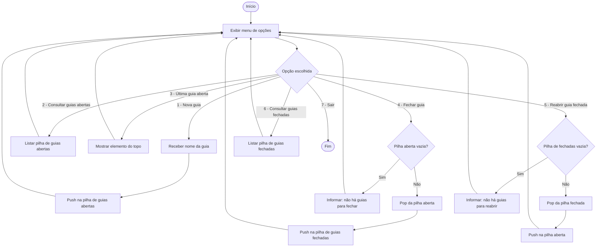
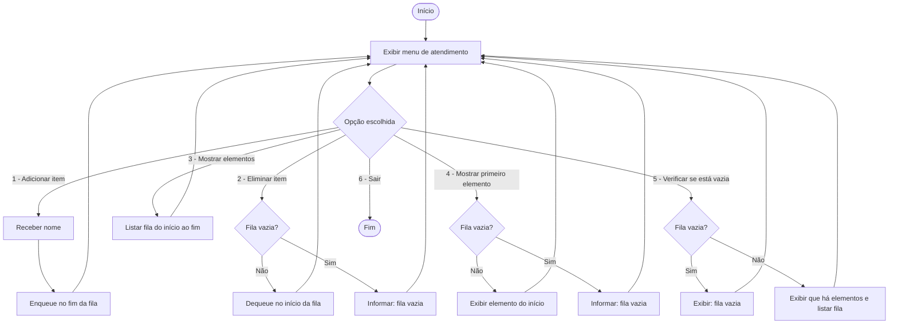

# Pilha e Fila — Atividade

Este repositório contém dois projetos em Java para praticar estruturas de dados lineares:

- **Pilha (LIFO)**: simula um gerenciador de guias do navegador, com abertura, fechamento e reabertura de guias.
- **Fila (FIFO)**: simula uma fila de atendimento, com entrada, saída e consulta de elementos.

## Estrutura do projeto

```text
Pilha&Fila(atividade)/
├── pom.xml
└── src/main/java/br/com/
    ├── Pilha/
    │   ├── Main.java
    │   ├── Pilha.java
    │   ├── No.java
    │   └── No2.java
    └── Fila/
        ├── Programa.java
        ├── fila.java
        └── No.java
```

## Como executar

No diretório raiz do repositório:

```bash
cd "Pilha&Fila(atividade)"
mvn compile
```

### Executar projeto da Pilha

```bash
mvn exec:java -Dexec.mainClass="br.com.Pilha.Main"
```

### Executar projeto da Fila

```bash
mvn exec:java -Dexec.mainClass="br.com.Fila.Programa"
```

---

## BPMN — Projeto Pilha (Gerenciamento de guias)



## BPMN — Projeto Fila (Atendimento)



## Conceitos aplicados

- **Pilha (LIFO)**: o último elemento inserido é o primeiro a sair.
- **Fila (FIFO)**: o primeiro elemento inserido é o primeiro a sair.
- **Nós encadeados** para representar dinamicamente os elementos.
